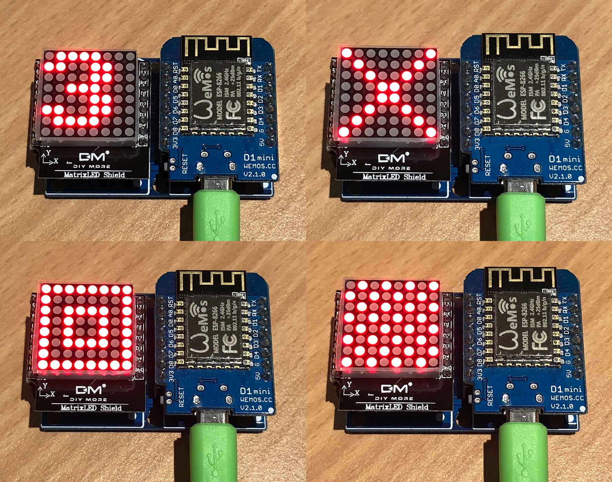

# MicroPython TM1640 LED Matrix

A MicroPython library for a LED matrix using the TM1740 LED driver.



## Examples

Copy the file to your device, using ampy, webrepl or compiling and deploying. eg.

```
$ ampy put tm1640.py
```

**Basic usage**

```python
import tm1640
from machine import Pin
tm = tm1640.TM1640(clk=Pin(14), dio=Pin(13))

# line from bottom left to top right
tm.write([1, 2, 4, 8, 16, 32, 64, 128])

# all on
tm.write([255, 255, 255, 255, 255, 255, 255, 255])

# all off
tm.write([0, 0, 0, 0, 0, 0, 0, 0])

# all LEDs dim
tm.brightness(1)

# all LEDs bright
tm.brightness(7)

# the number 3
tm.write([0b00000000, 0b00011110, 0b00110011, 0b00110000, 0b00011100, 0b00110000, 0b00110011, 0b00011110])

# cross
tm.write(b'\x81\x42\x24\x18\x18\x24\x42\x81')

# squares
tm.write([255, 129, 189, 165, 165, 189, 129, 255])

# 50% on
tm.write_int(0x55aa55aa55aa55aa)
```

For more detailed examples, see 

## Parts

* [WeMos D1 Mini](https://www.aliexpress.com/store/product/D1-mini-Mini-NodeMcu-4M-bytes-Lua-WIFI-Internet-of-Things-development-board-based-ESP8266/1331105_32529101036.html) $3.50 USD
* [Clone DIY More WeMos Matrix LED Shield](https://www.aliexpress.com/item/Matrix-LED-Shield-V1-0-0-For-WEMOS-D1-Mini-Digital-Signal-Output-Module-8-X/32821752799.html) $1.35 USD
* [Dual Base for WeMos D1 Mini](https://www.aliexpress.com/store/product/Dual-Base-for-WeMos-D1-mini/1331105_32642733925.html) $1.00 USD

## Connections

WeMos D1 Mini | TM1640 LED Matrix
------------- | -----------------
D5 (GPIO14)   | CLK
D7 (GPIO13)   | DIO
3V3 (or 5V)   | VCC
G             | GND

## Links

* [WeMos D1 Mini](https://wiki.wemos.cc/products:d1:d1_mini)
* [micropython.org](http://micropython.org)
* [TM1640 datasheet](http://www.titanmic.com/pic/other/2014-11-20-15-36-028.pdf)
* [Titan Micro TM1640 product page](http://www.titanmec.com/index.php/en/project/view/id/305.html)
* [MicroPython framebuf](http://docs.micropython.org/en/latest/esp8266/library/framebuf.html)
* [Adafruit Ampy](https://learn.adafruit.com/micropython-basics-load-files-and-run-code/install-ampy)

## License

Licensed under the [MIT License](http://opensource.org/licenses/MIT).
